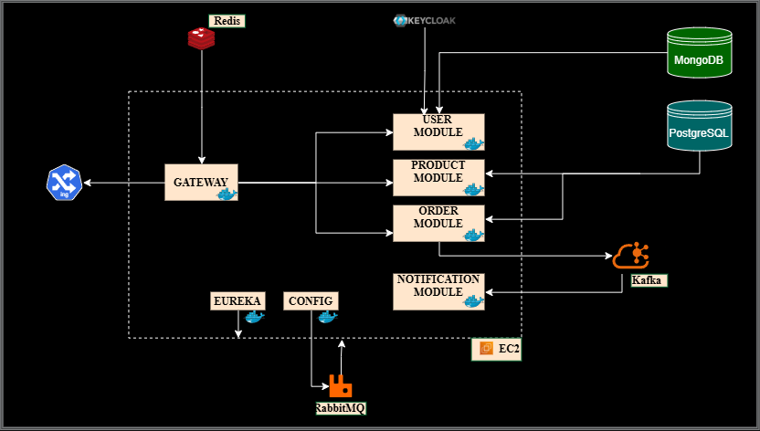
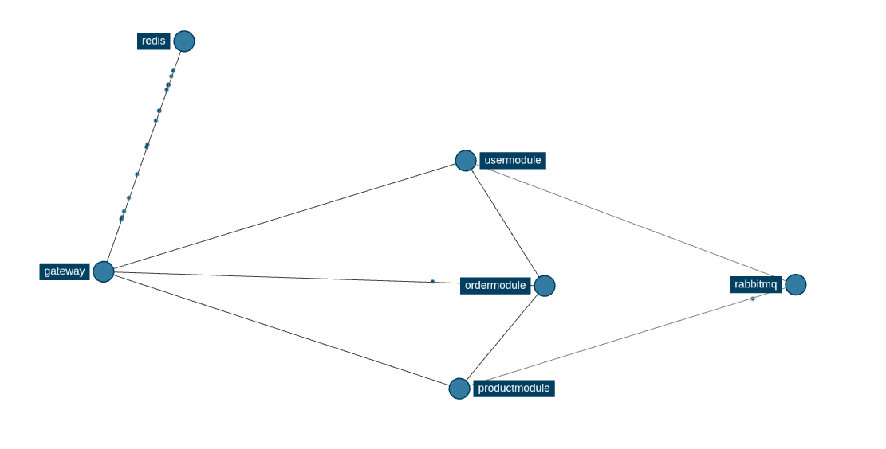

# Ecomm Microservice (Short README)

## Design


## What I Learnt
- **Spring Cloud Gateway**: a single entry point can route client traffic to the right backend service cleanly.
- **Eureka**: service discovery avoids hardcoded URLs and lets services find each other dynamically.
- **Spring Cloud Config + RabbitMQ bus-refresh**: centralized config can be refreshed across services without restarting all apps.
- **Redis**: rate limiting helps protect APIs from abuse and traffic spikes.
- **Kafka**: asynchronous, event-driven communication is better than direct service-to-service calls for flows like notifications.
- **Keycloak + OAuth2/OIDC**: real-world identity and access management is much broader than basic login handling.
- **Resilience4j**: retries and circuit breakers keep systems stable when downstream services fail.
- **Prometheus + Grafana + Loki**: observability makes it possible to monitor metrics, logs, and service health in one place.
- **Zipkin**: distributed tracing helps follow a single request across multiple services during failures.

## Zipkin Tracing


## Build the Project
From the repository root:

1. Build container images with Jib:
   ```bash
   cd Build
   chmod +x build-project.sh
   ./build-project.sh
   ```

2. (Alternative) Build images with Spring Boot buildpacks:
   ```bash
   cd Build
   chmod +x jib-build.sh
   ./jib-build.sh
   ```

## Quick Setup
1. Ensure Docker is running.
2. Set required environment variables used in `Build/docker-compose.yml` (database, Kafka, Redis, RabbitMQ, Keycloak, email, config/eureka/zipkin URLs).
3. Start the full stack:
   ```bash
   cd Build
   docker compose up -d
   ```
4. Access key services:
   - Gateway: `http://localhost:8080`
   - Eureka: `http://localhost:8761`
   - Zipkin: `http://localhost:9411`
   - Grafana: `http://localhost:3000`
